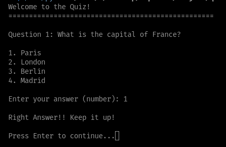

# General Knowledge Quiz

This Python script provides a basic general knowledge quiz with multiple-choice questions. 

## Features:

- **Multiple Choice Questions:** The quiz presents a series of multiple-choice questions with four options each.
- **User Interaction:** Users are prompted to enter their answers as numbers corresponding to the chosen option.
- **Feedback:** The quiz provides immediate feedback after each question, indicating whether the answer was correct or incorrect and showing the correct answer.
- **Progress Tracker:** The quiz includes separators to visually separate questions and provide a clear structure.

## Code Structure:

- **`questions` Dictionary:** This dictionary stores all the quiz questions and their information, including:
    - `question`: The actual question text.
    - `options`: A list of four options for each question.
    - `answer`: The correct answer for the question.
- **`print_separator()` Function:** This function prints a separator line for visual clarity between questions.
- **Main Program Logic:**
    - **Welcome Message:** Prints a welcome message at the beginning of the quiz.
    - **Question Iteration:** Loops through each question in the `questions` dictionary.
    - **Question Presentation:** Displays the question number, question text, and available options.
    - **User Input:** Prompts the user to enter their answer.
    - **Answer Validation:** Checks if the user's answer is correct and provides feedback accordingly.
    - **Progress Indicators:** Uses `input("Press Enter to continue...")` and `print_separator()` to pause between questions and separate them visually.
    - **End Message:** Prints an end message when all questions are answered.

## Example Output:

## Customization:

- **Questions:** You can easily modify or add new questions to the `questions` dictionary.
- **Difficulty:** Adjust the difficulty level of questions based on your target audience.
- **Topics:** Expand the quiz to cover a wider range of topics, such as history, science, geography, etc.

## Contributions:

Contributions are welcome! Feel free to submit pull requests with new questions, improved features, or bug fixes.

## License:

This project is licensed under the [MIT License](LICENSE).
